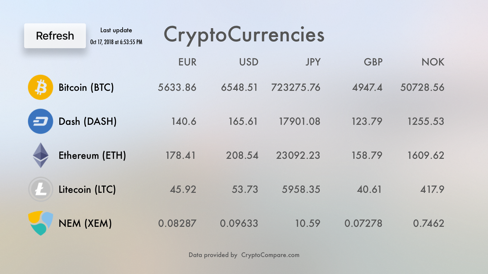
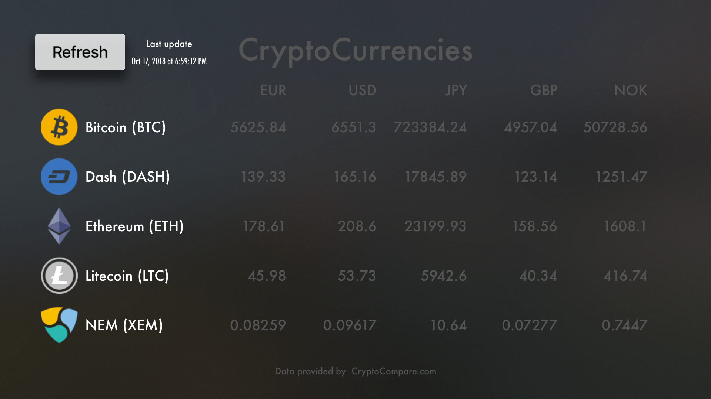

# CryptoCurrency - tvOS

**Light mode**

**Dark mode**

## Overview
This is just simple test to see how to do apps for tvOS. It does show cryptocurrency values by obtaining the data from free API, [CryptoCompare](https://min-api.cryptocompare.com/). 
*Read more about the API usage from their site and when it is available to be used freely.*

## Assets

### Images
Cryptocurrency  images are created by [Vladislav Sergeev](https://dribbble.com/kapklam)
*[(Alternative place to obtain)](https://freebies.fluxes.com/cryptocurrencies-logos/)*

### Git ignore
Good base to get different .gitignore files to help deciding what to not add to version control, can be seen here: https://www.gitignore.io/

I used this one: [Swift](https://www.gitignore.io/api/swift)

## Pods

Using following [pods](https://cocoapods.org/):

* [Alamofire](https://cocoapods.org/pods/Alamofire) - making networking easier

* [SwiftyJSON](https://cocoapods.org/pods/SwiftyJSON) - Better JSON handling